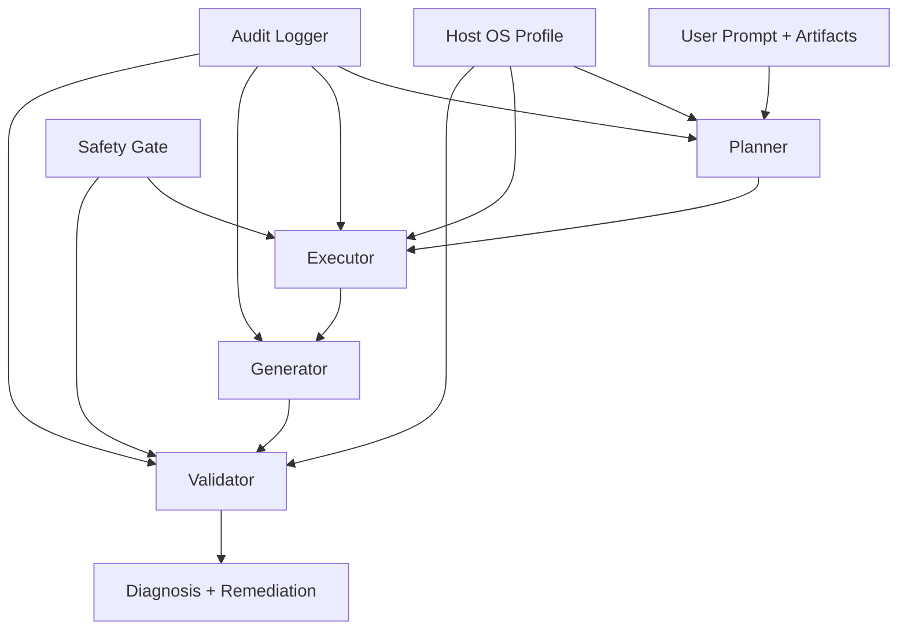

# network-agent

`network-agent` is a multi-agent troubleshooting framework for internet connectivity incidents.
It analyzes user reports plus network artifacts (`ping`, `traceroute`, logs, and pcap summaries) to identify likely root causes and produce safe remediation guidance.

## Goals
- Diagnose common network failures: connectivity, DNS, routing, transport, and security.
- Rank candidate root causes with explicit confidence and evidence requirements.
- Enforce safety: read-only checks, command whitelisting, and destructive-operation blocking.
- Keep an auditable trail of planning, tool execution, generation, and validation.
- Adapt checks and whitelist rules by host OS (macOS, Linux, Windows).

## Multi-Agent Architecture
1. **Planner**
   - Classifies input into: connectivity, DNS, routing, transport, security.
   - Selects checks/tools to run.
   - Adjusts check names by platform (example: `traceroute` vs `tracert`).
2. **Generator**
   - Produces a structured diagnosis object:
     - problem summary
     - ranked candidate causes
     - confidence score
     - required evidence
     - step-by-step remediation
3. **Validator**
   - Rule-based checks (regex, numeric thresholds, whitelist enforcement).
   - Safety gate for command controls.
   - Flags ambiguous cases for optional LLM critic (OpenAI, Anthropic, Ollama, or mock).
4. **Executor**
   - Runs allowed read-only checks (or parses provided artifact outputs).
   - Can collect live stats on demand (`ping`, `traceroute/tracert`, `netstat`, `nslookup`, `tcpdump` where available).
   - Supports OS-specific aliases for artifacts and commands.
   - Produces a topology snapshot of what the host sees (gateway, routes, neighbors, hops, interfaces).

## Cross-Cutting Components
- **Safety Gate**
  - strict command whitelist
  - forbidden token detection
  - no destructive exec
  - configuration-changing commands require explicit approval
  - OS-specific allowlist profiles
- **Audit Log**
  - logs planner/generator/validator inputs + tool call outputs to JSONL
- **Debug Trace (per request)**
  - optional request-scoped trace for each agent operation
  - includes inputs, outputs, timing, and request ID
- **Test Harness**
  - unit tests and synthetic scenarios

## Architecture Diagram


## OS Support Matrix
- **macOS**
  - Diagnostic commands: `ping`, `traceroute`, `dig`, `nslookup`, `route`, `netstat`, `scutil`, `networksetup`
- **Linux**
  - Diagnostic commands: `ping`, `traceroute`, `dig`, `nslookup`, `ip`, `ss`, `netstat`, `resolvectl`
- **Windows**
  - Diagnostic commands: `ping`, `tracert`, `nslookup`, `ipconfig`, `route`, `netstat`

Common blocked/destructive tokens include: `rm`, `sudo`, `shutdown`, `reboot`, `del`, `format`, `remove-item`.
Dual-use commands (`ip`, `route`, `networksetup`, `powershell`, etc.) are blocked if mutation tokens are present unless explicitly approved.

## Planned Tools & APIs
Current implementation:
- Local Python parsing modules (`regex`-based)
- Parsers for ping, traceroute/tracert, logs, and simple pcap summaries
- Optional strict whitelisted shell wrapper for read-only commands

Future optional integrations:
- GitHub API (read-only config fetch)
- Monitoring APIs (Prometheus/Grafana read-only)
- Cloud network APIs (AWS/GCP/Azure route/security-state readers)

## Validation & Safety
- Strict command whitelist by host OS
- Forbidden operations/tokens blocked (`rm`, `sudo`, `shutdown`, etc.)
- Live collection only runs read-only commands by default
- Any network configuration change is blocked unless user approval is explicitly supplied
- Numeric and structural validators for diagnosis quality
- Human-in-the-loop required for any config-changing suggestion
- Optional LLM critic can review ambiguous diagnoses; it does not bypass safety gates

## LLM Integration
LLM critic is optional and disabled by default.

Supported providers:
- `mock` (no API calls; deterministic local stub)
- `openai` (Chat Completions API)
- `anthropic` (Messages API)
- `ollama` (local `http://localhost:11434`)

LLM-assisted planner/generator agents are also optional and can run fully offline with a local model backend.
Supported agent providers:
- `ollama` (native API)
- `openai_compatible` (local OpenAI-compatible servers such as LM Studio or vLLM)
- `mock` (deterministic testing)

CLI example (`openai`):
```bash
network-agent \
  --prompt "I can't reach 8.8.8.8" \
  --enable-llm-critic \
  --llm-provider openai \
  --llm-model gpt-4o-mini
```

CLI example (`ollama`):
```bash
network-agent \
  --prompt "my network is unstable" \
  --enable-llm-critic \
  --llm-provider ollama \
  --llm-model llama3.2 \
  --llm-base-url http://localhost:11434/api/chat
```

CLI example (offline LLM-assisted agents with Ollama):
```bash
network-agent \
  --prompt "I cannot reach 8.8.8.8" \
  --enable-llm-agents \
  --agent-llm-provider ollama \
  --agent-llm-model llama3.2 \
  --agent-llm-base-url http://localhost:11434/api/chat \
  --dump-agent-prompts artifacts/agent-prompts.json
```

CLI example (offline LLM-assisted agents with OpenAI-compatible local server):
```bash
network-agent \
  --prompt "my network is unstable" \
  --enable-llm-agents \
  --agent-llm-provider openai_compatible \
  --agent-llm-model llama-3.2-3b-instruct \
  --agent-llm-base-url http://localhost:1234/v1/chat/completions
```

Interactive offline chat launcher:

macOS/Linux:
```bash
./llm/run_network_agent_chat.sh
```

Windows CMD:
```bat
llm\run_network_agent_chat.bat
```

If you run the CLI manually and see `ModuleNotFoundError: No module named 'network_agent'`,
run from repo root with:

macOS/Linux:
```bash
PYTHONPATH=src python -m network_agent.cli --prompt "I cannot reach 8.8.8.8"
```

Windows CMD:
```bat
set PYTHONPATH=src
py -m network_agent.cli --prompt "I cannot reach 8.8.8.8"
```

Environment variables:
- `NETWORK_AGENT_LLM_PROVIDER`
- `NETWORK_AGENT_LLM_MODEL`
- `NETWORK_AGENT_LLM_BASE_URL`
- `NETWORK_AGENT_LLM_API_KEY`
- `OPENAI_API_KEY` (fallback for `openai`)
- `ANTHROPIC_API_KEY` (fallback for `anthropic`)
- `NETWORK_AGENT_AGENT_LLM_PROVIDER`
- `NETWORK_AGENT_AGENT_LLM_MODEL`
- `NETWORK_AGENT_AGENT_LLM_BASE_URL`
- `NETWORK_AGENT_AGENT_LLM_API_KEY`

### Local Model Download
For offline usage, install a local runtime and pull a model:

Ollama:
1. Install from `https://ollama.com/download`.
2. Pull a model:
```bash
ollama pull llama3.2
```
3. Start service (if not already running):
```bash
ollama serve
```

LM Studio (OpenAI-compatible local server):
1. Install from `https://lmstudio.ai/`.
2. Download an instruction-tuned model in LM Studio.
3. Start the local OpenAI-compatible server and point `--agent-llm-base-url` to it.

## Debug Mode
Use debug mode to evaluate each agent operation for a single request.

CLI example:
```bash
network-agent \
  --prompt "I can't reach 8.8.8.8" \
  --debug \
  --debug-output artifacts/debug-request.json
```

When enabled, output includes `debug`:
- `request_id`
- request timing
- `agent_operations` with planner/executor/generator/validator inputs, outputs, and duration per step

## Network Topology Snapshot
Every execution can return `execution.network_topology` with:
- `default_gateway`
- `routes` and `route_count`
- `hops` and `hop_count`
- `neighbors` (ARP) and `neighbor_count`
- `interfaces`

Topology is built from available artifacts and, when enabled, live read-only commands (`route/netstat`, `arp`, `ipconfig`/`ifconfig`/`ip -br addr`).

## Risks & Open Questions
- Inconsistent/malformed logs can reduce confidence
- Real-device validation is constrained by safety policy
- Threshold tuning needed for packet loss vs transient spikes
- Privacy controls needed for trace/log secret redaction

## Suggested Additional Tools
- `mtr` parser support for route stability trends
- `iperf3` summary parsing for throughput bottlenecks
- DNS-specific checkers (`dig +trace`, `resolvectl` snapshot parser)
- Redaction module for secrets in logs/pcaps before ingestion
- Time-series anomaly plugin (latency/jitter baselines)

## Project Layout
- `.github/workflows/` CI pipelines
- `docker/lab/` reproducible Docker troubleshooting lab
- `samples/` curated synthetic artifact fixtures
- `src/network_agent/` core package
- `src/network_agent/agents/` planner, generator, validator, executor
- `src/network_agent/core/` schemas, host OS profiling, safety gate, audit logging
- `src/network_agent/parsers/` artifact parsers
- `src/network_agent/tools/` whitelisted tool wrappers
- `tests/` unit tests and synthetic validation cases
- `docs/` architecture and extension docs
- `CONTRIBUTING.md` contributor setup and standards

## CI (GitHub Actions)
- File: `.github/workflows/ci.yml`
- OS matrix: `ubuntu-latest`, `macos-latest`, `windows-latest`
- Python matrix: `3.10`, `3.11`, `3.12`
- Runs: editable install + `pytest -q`

## Docker Lab Scenarios
- Compose file: `docker/lab/docker-compose.yml`
- Script: `docker/lab/scripts/collect_scenarios.sh`
- Scenarios generated:
  - `ok`
  - `dns_failure`
  - `isolated_no_internet`

Run:
```bash
docker compose -f docker/lab/docker-compose.yml up -d --wait
./docker/lab/scripts/collect_scenarios.sh
docker compose -f docker/lab/docker-compose.yml down -v
```

OS limitation:
- Docker lab runs Linux containers only.
- macOS/Windows behavior is validated by cross-platform CI and OS-aware planner/safety logic.

## Quickstart
```bash
python -m venv .venv
source .venv/bin/activate
pip install -e .[dev]
pytest
```

Run with artifact files:
```bash
network-agent \
  --prompt "$(cat samples/dns_failure/prompt.txt)" \
  --host-os auto \
  --ping samples/dns_failure/ping.txt \
  --traceroute samples/dns_failure/traceroute.txt \
  --logs samples/dns_failure/logs.txt \
  --pcap-summary samples/dns_failure/pcap_summary.txt
```

Run with live collection fallback for missing artifacts:
```bash
network-agent \
  --prompt "I cannot reach 8.8.8.8 from this host" \
  --host-os auto \
  --collect-live-stats
```

Disable topology generation:
```bash
network-agent --prompt "diagnose network issue" --skip-topology
```

Approval gate:
- `--allow-config-changes` exists for explicit approval paths.
- Without this flag, config-changing commands are blocked by safety gate.

If the target is Windows, use `--host-os windows` and provide `tracert` output under `--traceroute` (or store it with a `tracert` artifact key in code-level integrations).

## Example Prompts
1. "I can’t reach 8.8.8.8. Here’s my traceroute and ping output — what’s wrong?"
2. "My webserver is slow — netstat and tcpdump summary attached — suggest root cause and 3 candidate fixes."

## Current Status
This repo currently provides an extensible baseline implementation and tests for synthetic cases.
