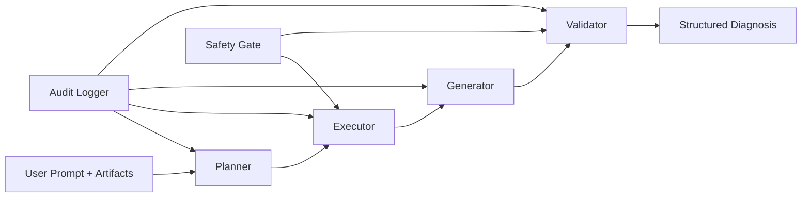

# Architecture Overview

## Domain
- **Chosen domain:** Other approved domain - Network Troubleshooting Agent.
- **Core objective:** Convert user-reported connectivity symptoms + artifacts into a ranked, safe, auditable diagnosis.

## Component Map

## Responsibilities

### Planner
- Classifies incident category.
- Selects checks by category and OS profile.
- Supports optional LLM-assisted planning with schema normalization.

### Executor
- Resolves artifacts or collects missing evidence with safe commands.
- Parses raw outputs into structured intermediate data.
- Supports bounded packet capture windows (`--capture-seconds` or prompt-based seconds).

### Generator
- Ranks candidate causes and remediation plans.
- Uses deterministic heuristics by default.
- Supports optional LLM-assisted diagnosis with strict fallback.

### Validator
- Enforces structural and numeric constraints.
- Applies safety gating and approval checks.
- Can call optional LLM critic for ambiguous outputs.

## Data Contracts
- `PlannerPlan`
- `ExecutionResult`
- `Diagnosis`
- `ValidationResult`

These contracts bound stage interfaces and simplify testability.

## Safety Posture
- Read-oriented command allowlist by OS.
- Destructive tokens blocked.
- Dual-use mutation commands require approval.
- LLM verdicts are advisory, never privileged over deterministic safety checks.
