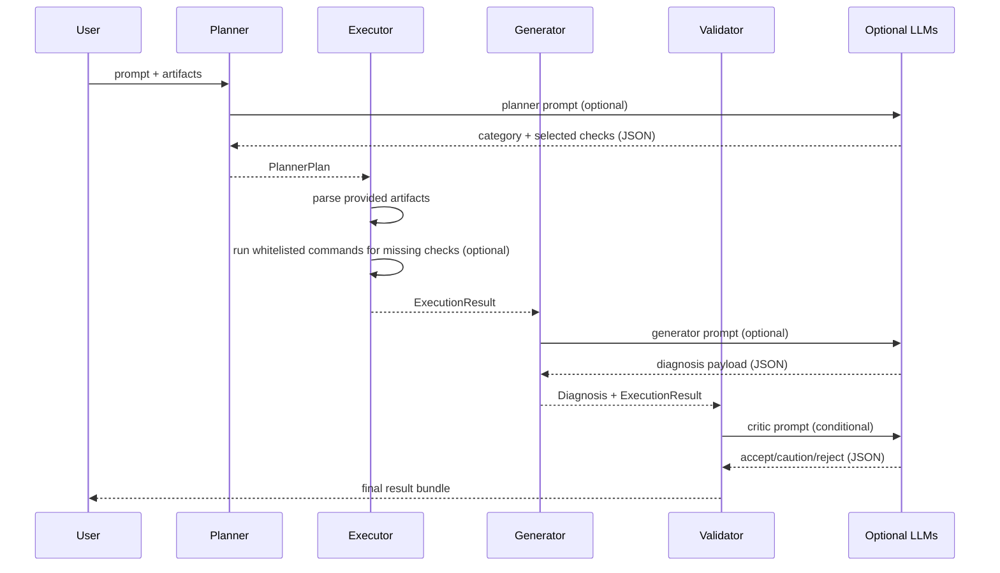

# LLM and Tool Call Sequence

## End-to-End Sequence

## Intermediate Representations
1. `PlannerPlan`
   - category
   - selected checks
   - rationale
   - host_os

2. `ExecutionResult`
   - raw outputs
   - parsed outputs
   - executed/missing checks
   - topology snapshot
   - collection attempts/errors

3. `Diagnosis`
   - problem summary
   - ranked causes + confidence
   - required evidence
   - remediation plan

4. `ValidationResult`
   - valid flag
   - reasons
   - blocked operations
   - optional critic verdict

## Prompt Roles
- Planner prompt: triage and check selection.
- Generator prompt: evidence-grounded hypothesis generation.
- Validator critic prompt: consistency and evidence sufficiency check.

## Tool Calls
- Safe shell diagnostics only (allowlisted by OS).
- Packet capture (`tcpdump`) is time bounded by capture duration controls.
- No destructive operations permitted without explicit approval path.
