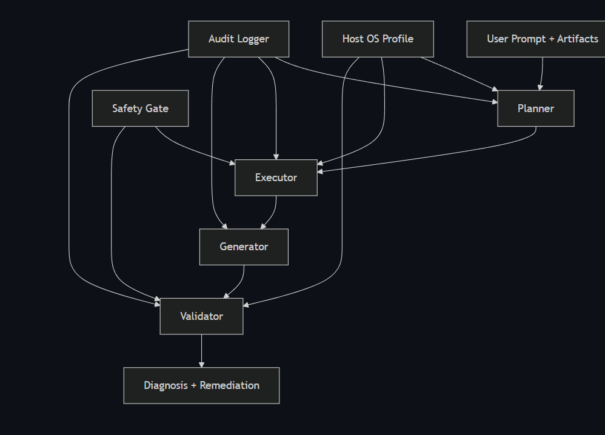
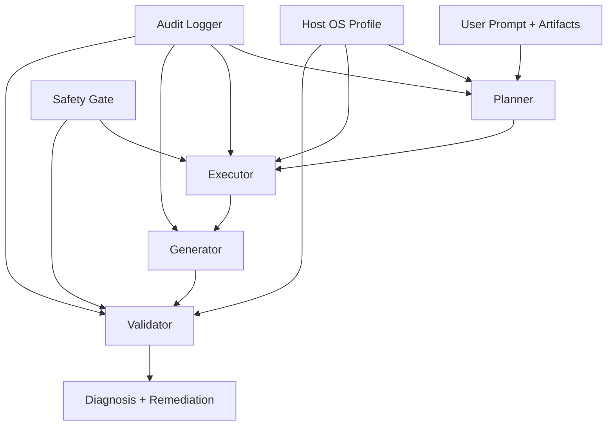
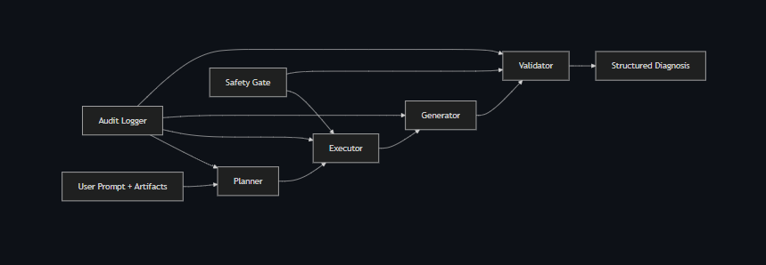
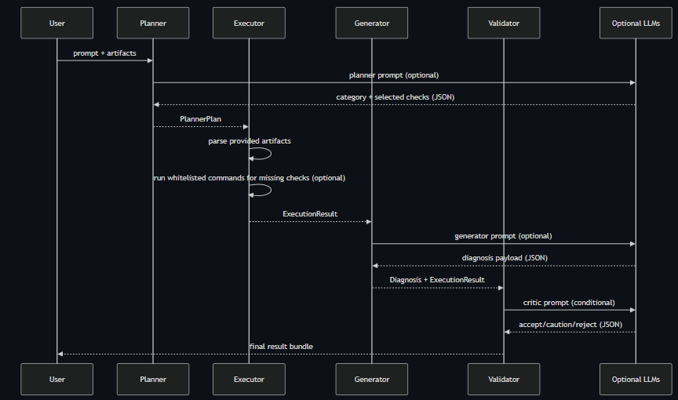
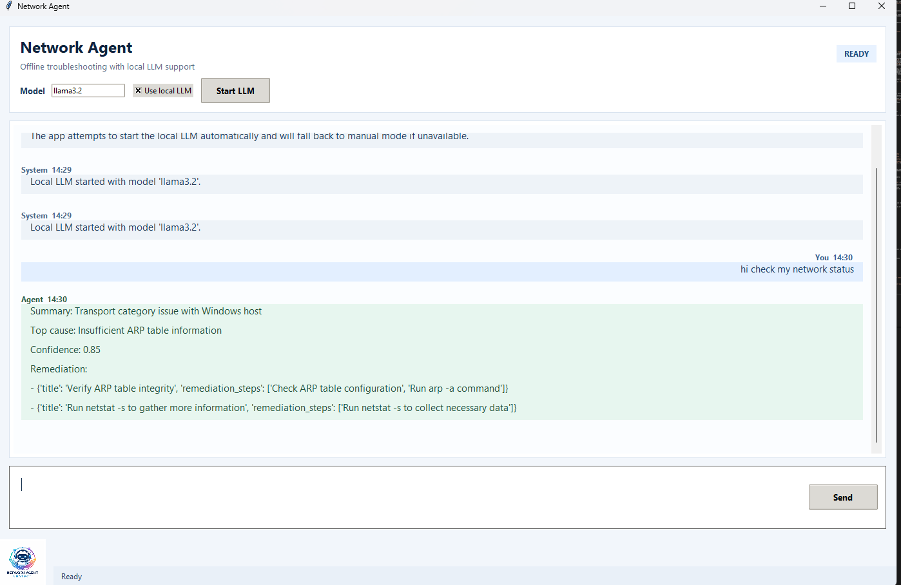
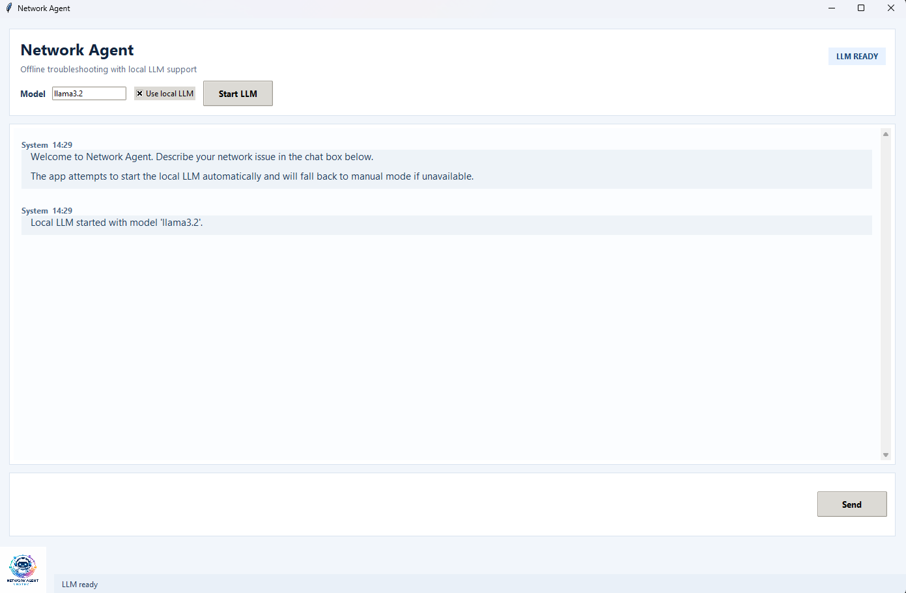

# Network Agent Project Report

## 1. Project Overview and Goals

### Problem statement
Modern network outages are often diagnosed manually by stitching together partial evidence from `ping`, `traceroute`, logs, and packet-level summaries. This process is slow, error-prone, and highly dependent on operator experience. In classroom and small-team settings, this creates two practical problems:

1. Analysts can miss obvious contradictions between data sources.
2. Analysts can run unsafe or unnecessary commands while trying to collect more evidence.

`network-agent` addresses this by implementing a **multi-agent troubleshooting pipeline** that consumes user prompts and network artifacts, then produces a structured diagnosis with confidence, required evidence, and remediation guidance.

### Why this is interesting
This project is interesting from a systems and research perspective because it sits at the intersection of:

- **Agent orchestration**: planner, executor, generator, validator roles with explicit data contracts.
- **Safety-critical tooling**: command allowlists, mutation detection, and approval gating.
- **Hybrid reasoning**: deterministic parser/rule logic augmented by optional LLM assistance.
- **Cross-platform execution**: Linux, macOS, and Windows command mapping and constraints.

The key design target is not “maximal model creativity.” It is **reliable, auditable diagnosis under operational constraints**.

### Project goals
The system is designed around six concrete goals:

- Classify incidents into common network categories.
- Select and run only safe, read-oriented diagnostics by default.
- Produce ranked causes with explicit confidence and evidence links.
- Preserve a trace of each agent stage for reproducibility.
- Support optional local/offline LLM assistance.
- Remain usable by instructors with straightforward run instructions.

## 2. Chosen Domain

### Domain choice
This project uses an **Other approved domain**: **Network Troubleshooting Agent**.

### Domain-specific constraints
Compared with generic assistant tasks, this domain has strict requirements:

- Inputs are heterogeneous and noisy (logs, traceroute hops, packet summaries).
- Suggested actions can have real operational risk if not constrained.
- Cross-platform command semantics differ (`traceroute` vs `tracert`, interface commands, route tools).
- “Correctness” often means “best-supported hypothesis with evidence gaps identified,” not a single exact answer.

### Why this domain fits a multi-agent architecture
Each subproblem maps naturally to a specialized agent:

- Planner handles triage and check selection.
- Executor handles data collection/parsing under policy constraints.
- Generator handles explanation and ranked causes.
- Validator handles constraint checks, confidence sanity checks, and safety consistency.

This separation improved maintainability and made testing easier because each stage has a narrow contract.

## 3. Agent Architecture

### High-level architecture

### Component responsibilities

#### Planner
- Classifies incident category (`connectivity`, `dns`, `routing`, `transport`, `security`, `unknown`).
- Selects relevant checks for that category.
- Applies host-OS adaptations.
- Optionally accepts an LLM-assisted plan when available and valid.

#### Executor
- Uses provided artifacts first.
- Optionally collects missing evidence live with whitelisted commands.
- Normalizes and parses outputs into structured intermediate representations.
- Builds topology snapshot (gateway, routes, neighbors, hops, interfaces).
- Supports configurable live capture duration (default 30s, user override via CLI or prompt).

#### Generator
- Produces `Diagnosis` object:
  - problem summary
  - ranked candidate causes
  - confidence score
  - required evidence
  - remediation plan
- Uses deterministic heuristics by default.
- Optionally switches to LLM-assisted diagnosis generation with schema checks/fallback.

#### Validator
- Enforces structural and numeric checks.
- Applies safety gate to proposed commands.
- Marks ambiguous cases and can invoke optional LLM critic.
- Treats LLM verdict as advisory; safety gate and deterministic constraints remain authoritative.

### Cross-cutting infrastructure
- **SafetyGate**: command allowlists, forbidden tokens, mutation-token approval checks.
- **AuditLogger**: JSONL trace per stage.
- **Debug trace**: request-scoped operation inputs/outputs/timings.

## 4. Multi-LLM Call Flow

The project uses multiple LLM-capable interaction points with explicit roles.

### LLM roles
1. **Planner LLM (optional)**
   - Input: user prompt + artifact preview + host OS.
   - Output schema: `category`, `selected_checks`, `rationale`.
   - Validation: category and check whitelist normalization; fallback to deterministic planner if invalid.

2. **Generator LLM (optional)**
   - Input: selected checks, parsed outputs, missing checks, topology, user prompt.
   - Output schema: diagnosis payload with ranked causes and remediation.
   - Validation: cause list non-empty, confidence clamping, fallback remediation/evidence defaults.

3. **Validator LLM Critic (optional and conditional)**
   - Trigger: low confidence or high ambiguity.
   - Input: diagnosis summary + execution context.
   - Output schema: `verdict`, `confidence`, `notes`, `suggested_evidence`.
   - Handling: `reject`/`caution` becomes validation reasons; cannot bypass safety gate.

### Intermediate representations
The pipeline relies on explicit typed/dict structures between stages:

- `PlannerPlan`
- `ExecutionResult` (raw outputs, parsed outputs, missing checks, topology)
- `Diagnosis`
- `ValidationResult`

LLM outputs are treated as untrusted until parsed, shape-checked, normalized, and optionally clamped.

### Coordination strategy
The coordination model is linear with hard boundaries:

1. Planner commits check set.
2. Executor resolves artifact/live data and parsing.
3. Generator ranks causes using evidence.
4. Validator checks constraints and confidence behavior.

This avoids hidden side effects and keeps debugging straightforward because each stage has explicit inputs and outputs logged to audit/debug channels.

## 5. Tools and APIs Used

### Core implementation tools
- Python package modules in `src/network_agent/`.
- Regex-based parsers for ping, traceroute, logs, pcap summary.
- Dataclasses for contracts and serialization.

### Local and optional LLM connectors
- `mock` provider (deterministic/testing).
- `ollama` provider for offline local inference.
- `openai` and `openai_compatible` for API-compatible backends.
- `anthropic` support in critic path.

### System diagnostics / shell tools
- `ping`, `traceroute`/`tracert`, `nslookup`, `netstat`, `route`, `arp`, interface info commands.
- `tcpdump` for read-only capture on supported non-Windows hosts.

### Development/test tooling
- `pytest` for unit-style checks.
- Synthetic sample fixtures in `samples/`.
- Cross-platform CI configuration (Linux/macOS/Windows matrix in repository workflow).

## 6. Validation and Safety Checks

### Safety model
Safety is implemented as a first-class constraint, not an afterthought.

- OS-specific command allowlist.
- Forbidden destructive tokens (e.g., `rm`, `shutdown`, `format`).
- Dual-use command mutation detection (`add`, `set`, `delete`, etc.).
- Explicit approval path for potential configuration-changing actions.

### Structural and semantic checks
Validator logic checks for:

- Presence of candidate causes.
- Confidence range consistency (`0..1`).
- Evidence sanity checks (e.g., packet loss bounds).
- Ambiguity detection and optional critic invocation.

### Capture-duration controls
Live capture duration now includes controls to prevent runaway collection:

- CLI flag `--capture-seconds` with bounds (5 to 300).
- Prompt-based override parsing (e.g., “capture for 45 seconds”).
- Timeout enforcement in shell runner with partial-output handling on timeout.

### Testing evidence
The repository includes tests that cover:

- Planner classification and OS behavior.
- Executor live collection behavior.
- Validator command blocking and approval path.
- Engine operation trace and integration outputs.
- LLM-path integration with mock provider.

## 7. Results and Discussion

### What works well
1. **Deterministic baseline remains reliable**
   The parser + heuristic pipeline yields consistent outputs across synthetic scenarios.

2. **LLM integration is optional and bounded**
   LLM-assisted planning/generation can be enabled for richer behavior while preserving deterministic fallback.

3. **Safety constraints are explicit and testable**
   Command gating, mutation detection, and approval paths are encoded in code and exercised in tests.

4. **Offline usability improved**
   Local model startup wrappers (`.sh` + `.bat`) and GUI/CLI launchers support constrained environments.

5. **Cross-platform practical fixes were incorporated**
   Windows-specific issues (launcher behavior, import path setup, decode handling, ping timeout bounds) were addressed with targeted changes.

### Measured outcome snapshot
Using `demo.py`, three end-to-end interactions were executed with full agent loop and debug trace:

- `dns_failure` -> category `dns`, top cause `DNS resolution failure`.
- `connectivity_loss` -> category `connectivity`, top cause `High packet loss indicates unstable or broken link`.
- `transport_retransmits` -> category `transport`, top cause `Transport congestion or drops causing retransmissions`.

Artifacts and traces are included under `examples/interactions/`.

### Failure modes observed
- Incomplete/malformed pcap summary reduces transport-confidence quality.
- Extremely sparse artifacts may force low-confidence generic diagnosis.
- Live capture commands can fail due to permission/environment limitations.
- LLM output schema drift can occur on unsupported or poorly tuned local models (handled via fallback, but still a UX limitation).

### Tradeoffs and design decisions
- **Conservative safety over broad command freedom**: fewer dangerous operations, but less automated remediation.
- **Linear agent pipeline over dynamic planner-executor loops**: easier to reason about and test, but less adaptive in long investigations.
- **Strict schema checks over permissive parsing**: more robust behavior under unexpected LLM outputs, but occasional fallback to heuristic path.

## 8. Limitations and Extensions

### Current limitations
- No deep packet parsing beyond summary signals.
- No integration with external telemetry backends (Prometheus/Grafana/cloud APIs) yet.
- Root-cause confidence remains heuristic and not calibrated with a large empirical corpus.
- Live capture on Windows is limited by tooling differences.

### Near-term extensions
- Add richer packet/event parsers (e.g., mtr, iperf3, DNS trace depth).
- Add redaction pipeline for sensitive logs/artifacts.
- Implement confidence calibration on labeled incident datasets.
- Add iterative clarification loop when evidence is insufficient.
- Extend GUI to include structured evidence upload and timeline visualization.

## 9. Conclusion

`network-agent` demonstrates a practical multi-agent architecture for network diagnostics with explicit safety controls, auditable execution, and optional local/offline LLM assistance. The system is not designed as a free-form autonomous operator; instead, it is a constrained diagnostic partner that prioritizes traceability and correctness under uncertainty. This design choice made the project robust, testable, and suitable for instructional evaluation while leaving clear paths for future research extensions.
